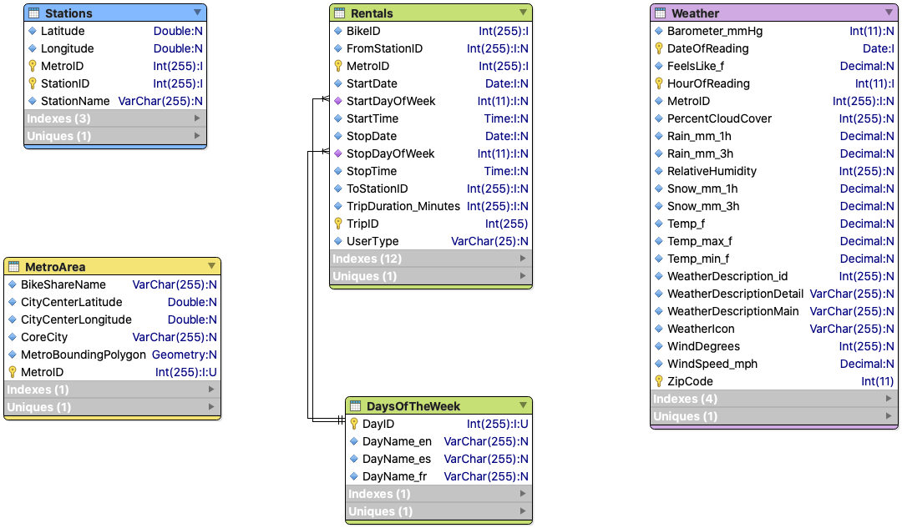
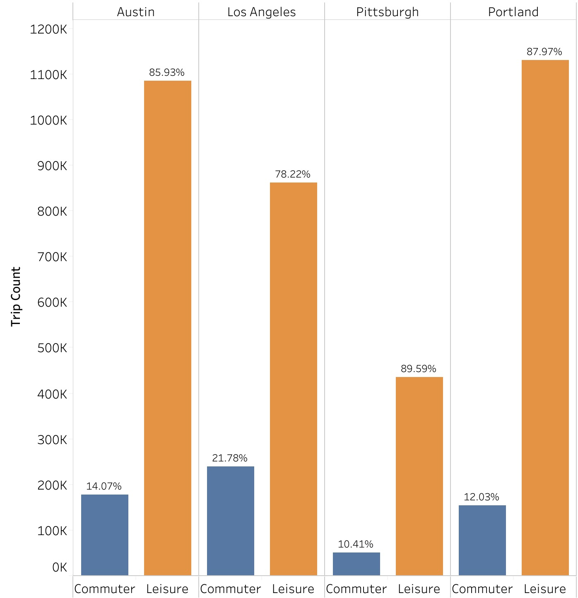
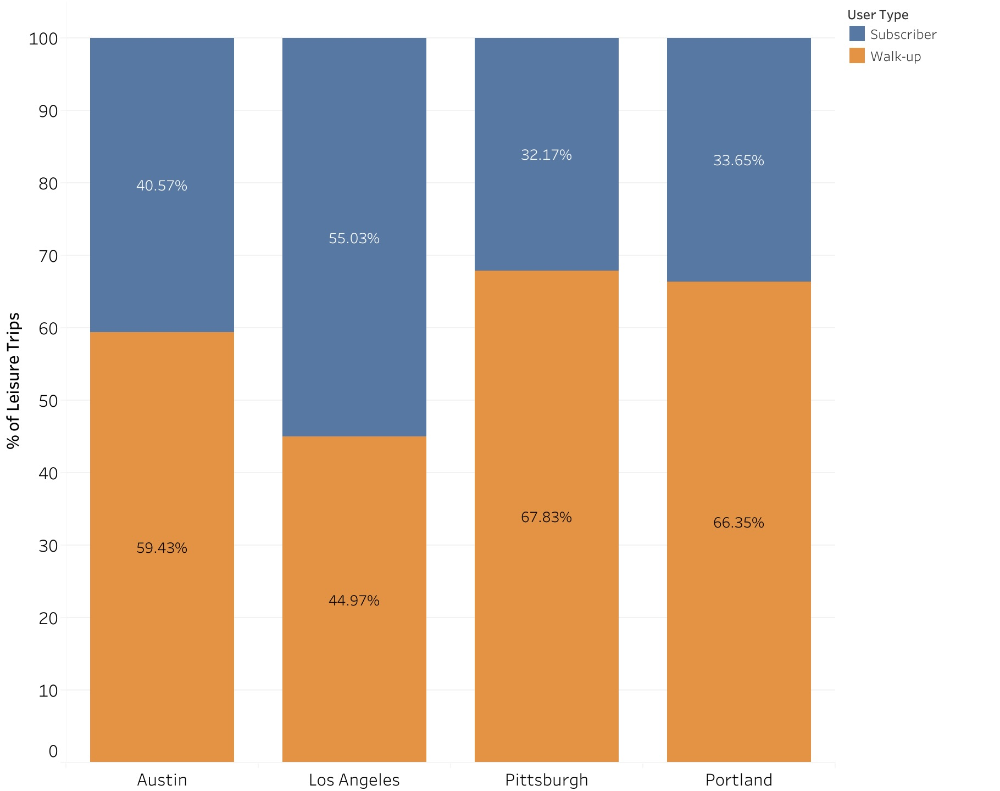
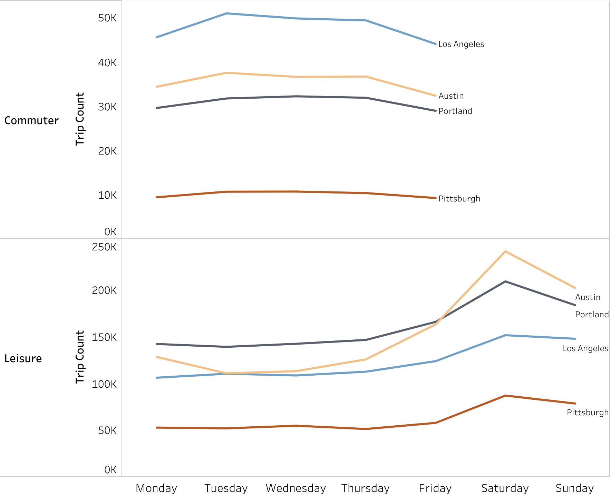
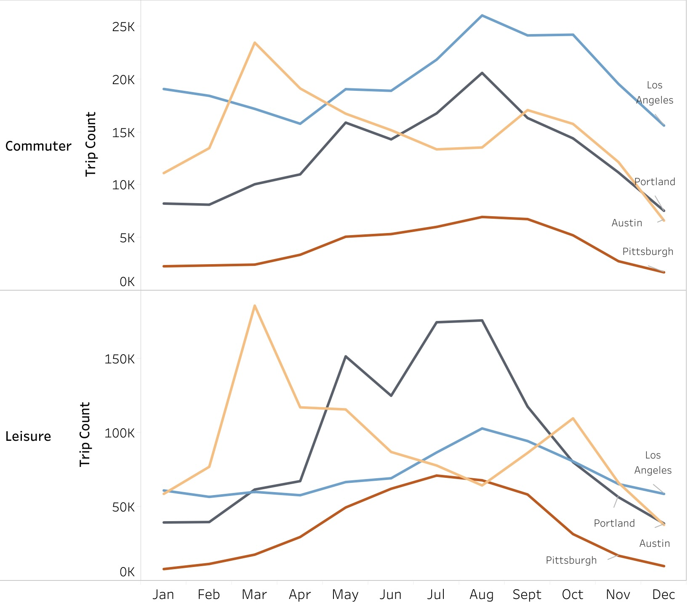
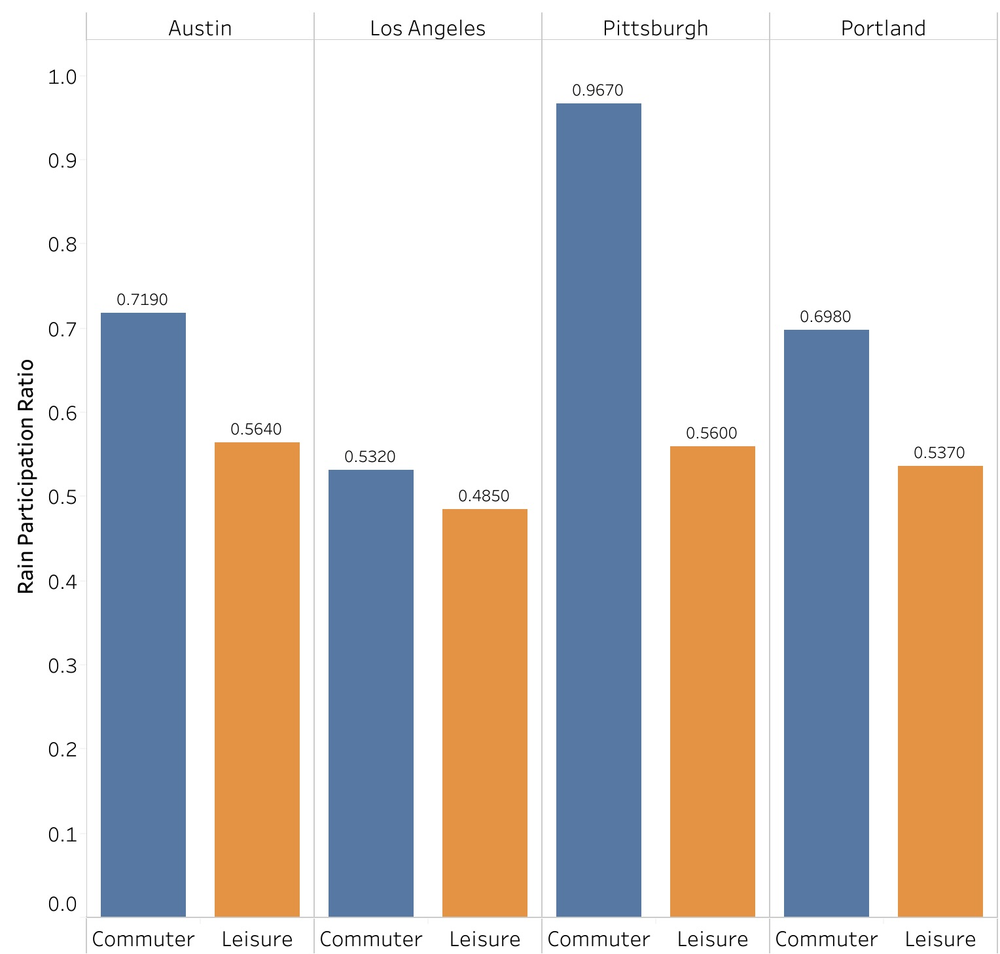
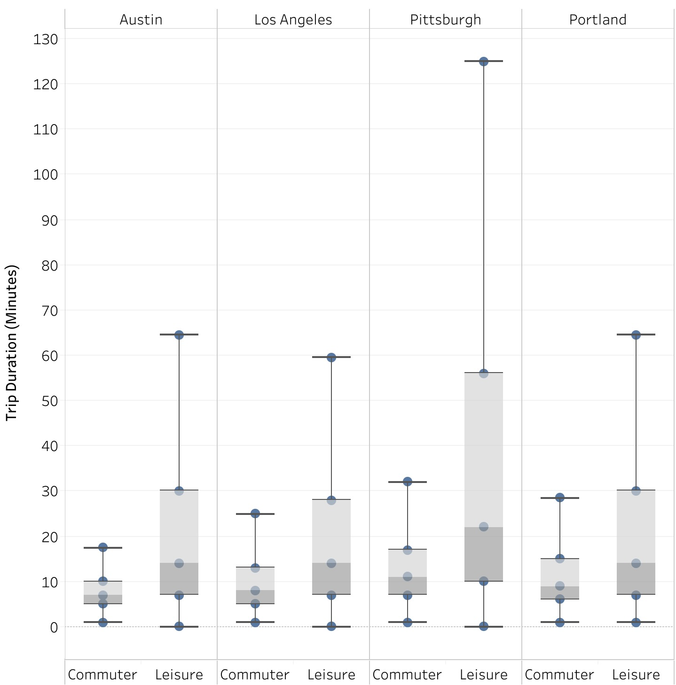
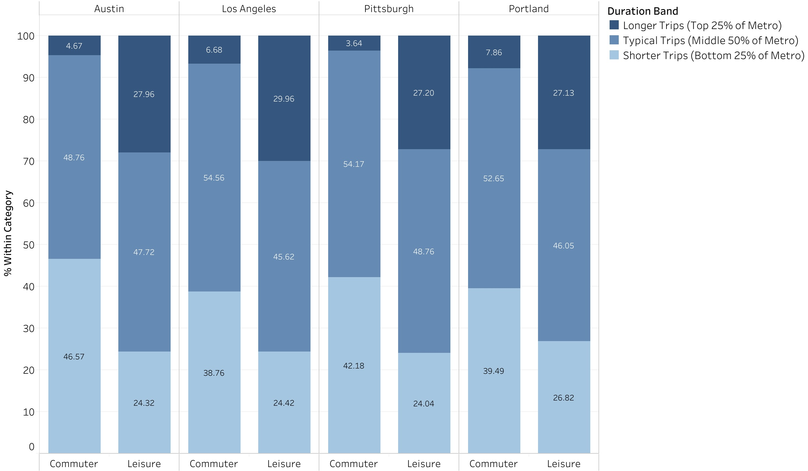

# BikeShare User Behavior Analysis

## Project Background

This project analyzes bike share rental data across four metro areas: Austin, Los Angeles, Pittsburgh, and Portland. Each rental represents a single trip taken by a user, either as a subscriber (membership-based) or a walk-up customer.

The goal is to understand how bike share systems are used differently across markets, specifically comparing commuting vs. leisure usage. This distinction is important because commuting trips tend to be predictable, time-sensitive, and recurring, while leisure trips are more flexible and influenced by external factors like weather and weekends.

Insights and recommendations are provided across three key areas:

- **Category 1: Market Structure**  
  How trips are distributed across metros, user types, and trip categories  

- **Category 2: Temporal Patterns**  
  How usage varies by time of day, day of week, and season  

- **Category 3: Trip Behavior**  
  How trip characteristics (duration, distance proxies, station usage) differ between commuting and leisure  

Targeted SQL queries for each category can be found here:

- [Category 1 Queries](01_market_structure/01_market_structure.sql)
- [Category 2 Queries](02_temporal_patterns/02_temporal_patterns.sql)
- [Category 3 Queries](03_trip_behavior/03_trip_behavior.sql)

## Data Structure & Initial Checks

The BikeShare database consists of five main tables with rental, location, time, and weather data. The core table used for analysis is the `Rentals` table, where each row represents a single trip.

### Database Schema

---

### Main Tables

#### Rentals
Contains trip-level data including start/end time, stations, trip duration, and user type. Each row represents one rental.

**Key fields:**
- `TripDuration_Minutes` — trip length  
- `UserType` — Subscriber vs Walk-up  
- `FromStationID` / `ToStationID`  
- `StartDate`, `StartTime`, `StartDayOfWeek`  

#### Stations
Contains station-level data including location and metro assignment. Includes a special “dockless” station for trips not starting or ending at a fixed station.

#### MetroArea
Defines the four metro areas and their associated bike share systems. Used to group and compare markets.

#### DaysOfTheWeek
Lookup table mapping numeric day IDs (1–7) to day names.

#### Weather
Hourly weather data for each metro area, including temperature, precipitation, and conditions. Used to analyze how weather affects trip behavior.

---

### Initial Checks & Data Cleaning

Before analysis, several checks were performed to ensure data quality:

- **Trip Duration Validation**  
  Trips with `TripDuration_Minutes = 0` were reviewed. These may represent data errors or immediate returns (e.g., unlocking and re-locking a bike). These were considered for filtering or separate handling.

- **Station Consistency**  
  Trips where `FromStationID = ToStationID` were identified. These may indicate round trips or non-meaningful movement and were treated carefully in classification.

- **Dockless Trips**  
  Trips with `StationID = -5000` were flagged as dockless. These were retained but considered separately when analyzing station-based behavior.

- **Missing Values**  
  Some fields (e.g., time, station IDs) allow nulls. These were checked and excluded where necessary for analysis consistency.

- **Time Features**  
  Additional fields such as time-of-day buckets and seasons were derived from `StartTime` and `StartDate` to support temporal analysis.

- **Trip Classification Setup**  
  Trips were labeled as **Commuter** or **Leisure** based on:
  - Weekday vs weekend  
  - Peak commuting hours (06:30–09:30 and 16:00–19:00)  
  - Subscriber vs walk-up users  
  - Different start and end stations  

This cleaned and structured dataset forms the basis for all subsequent analysis.

## Executive Summary

BikeShare is used mostly for leisure across all four metros. These trips are longer, more flexible, and less focused on speed, while commuting trips are short, consistent, and follow weekday routines.

BikeShare should treat these as two different use cases:
- Keep commuting reliable and easy to access during peak hours  
- Focus most decisions on improving and growing leisure usage through pricing, bike availability, and product features that support longer and more flexible rides  

---

## Category 1: Market Structure

### Leisure dominates usage across all metros

   

- Leisure trips account for the majority of rides in every city, ranging from 78.22% in Los Angeles to 89.59% in Pittsburgh. 
- Austin (85.93%) and Portland (87.97%) follow a similar pattern.
- Commuter trips are much lower (10%–22%), showing that bike share is primarily used for non-commuting purposes across all markets.

---

### Los Angeles has the highest commuting share, but leisure still dominates
Los Angeles has the highest share of commuter trips at 21.78%, compared to:
- Austin: 14.07%  
- Portland: 12.03%  
- Pittsburgh: 10.41%  

This suggests stronger commuting adoption in LA, but even there, nearly 4 out of 5 trips are still leisure.

---

### Leisure user composition differs by metro

   

In Los Angeles, 55.03% of leisure trips come from subscribers, making it the only metro where leisure usage is primarily subscription-based.  

In contrast:
- Austin: 59.43% walk-up  
- Pittsburgh: 67.83% walk-up  
- Portland: 66.35% walk-up  

This shows that while leisure dominates everywhere, the type of user driving leisure demand differs by market.

---

### Most leisure trips are one-way, with Pittsburgh showing more round-trip behavior
Across metros, the majority of leisure trips are one-way (70%–82%), meaning users are traveling between different locations.

Pittsburgh stands out with 29.62% round trips, higher than:
- Austin: 18.06%  
- Los Angeles: 18.46%  
- Portland: 21.9%  

This suggests more recreational, loop-style riding in Pittsburgh.

---

### Dockless usage varies significantly by metro
- Austin and Los Angeles are fully station-based (100%)  
- Pittsburgh has limited dockless usage (~7–9%)  
- Portland stands out with 45.51% dockless usage  

This shows that infrastructure differences shape how leisure trips are taken, even if overall usage patterns remain similar.

---

### Overall pattern
Leisure dominates in all metros, but how people take leisure trips differs by market:
- **Who** takes the trips (subscriber vs walk-up)  
- **How** trips are structured (one-way vs round-trip)  
- **How** bikes are accessed (station vs dockless)  

The key difference across metros is not whether bikes are used for leisure, but how that leisure usage happens.

## Category 2: Temporal Patterns

### Commuter demand is stable on weekdays, while leisure spikes on weekends

   

- Commuter trips are evenly distributed Monday–Friday in all cities, with each day contributing roughly 18%–21% of trips.  
- In contrast, leisure trips increase sharply on weekends.  
- For example, in Austin, leisure rises from ~10–15% on weekdays to 22.24% on Saturday, with similar patterns across all metros.  

This shows commuting is routine-based, while leisure is concentrated on weekends.

---

### Weekend spikes reinforce that bike share is mainly used for leisure
- Across all metros, the highest leisure usage occurs on Saturday and Sunday.  
- For example, Austin reaches ~241K trips on Saturday compared to ~110K midweek.  
- This same pattern appears in Los Angeles, Pittsburgh, and Portland.  

This reinforces that overall bike share usage is driven more by leisure than commuting, especially during free time.

---

### Commuting is stable year-round, while leisure is seasonal

   

- Monthly variation in commuter share is lower but commuting patterns do change across months similar to leisure trips.  
- Leisure trips fluctuate more, increasing in warmer months and decreasing in colder months.  

Commuting shows smaller fluctuations year-round, but both leisure and commuting is influenced by season and external conditions.

---

### Leisure peaks in summer in most metros, with Austin as an exception
- In Los Angeles, Pittsburgh, and Portland, leisure trips increase through spring and peak in July–August.  
- Portland, for example, reaches around ~170K–180K trips in summer.  
- Austin shows a different pattern, with a decline during peak summer months, likely due to extreme heat.  

This highlights how local climate affects leisure demand even when overall patterns are similar.

---

### Commuters are more resilient to rain than leisure riders

   

- The Rain Participation Ratio compares how often trips occur in rain relative to how often it rains.  
- A value of 1 means trips occur at the same rate as rain; below 1 means people avoid riding in rain.  

**Commuter ratios (higher):**
- Austin: 0.72  
- Portland: 0.70  
- Pittsburgh: 0.97  

**Leisure ratios (lower):**
- Austin: 0.56  
- Portland: 0.54  
- Pittsburgh: 0.56  

This shows commuters are more likely to ride even in rain, while leisure riders avoid bad weather.

---

### Rain affects leisure more than commuting, but the overall impact is small
- A Chi-Square Test of Independence was used to test the relationship between rain and trip type.  
- Results show statistically significant relationships, but very small effect sizes (Cramér’s V: 0.005–0.053).  

This means rain slightly reduces leisure trips more than commuting, but does not strongly change overall usage patterns.

---

### Overall pattern
- Commuting follows consistent weekday routines and is less affected by season or weather.  
- Leisure, which dominates total usage, varies by weekends, seasons, and weather conditions.  

The key difference is not just how much each type is used, but how sensitive each is to time and external factors.

## Category 3: Trip Behavior

### Leisure trips are significantly longer than commuter trips
Average trip duration (with outliers removed) is consistently higher for leisure:

- Austin: 17.46 min (leisure) vs 7.14 min (commuter)  
- Los Angeles: 15.97 vs 9.19  
- Pittsburgh: 30.10 vs 11.73  
- Portland: 17.52 vs 10.09  

This shows commuting trips are short and direct, while leisure trips involve longer, more flexible riding.

---

### Leisure trips are more variable and less predictable

   

- Standard deviation of duration is much higher for leisure (e.g., Pittsburgh: 28.3 vs 6.32).  
- Maximum durations are also much larger (e.g., Pittsburgh: 125 minutes vs 32 for commuters).  

This means leisure usage includes both short and very long rides, while commuting is more consistent.

---

### Commuter trips are concentrated in short durations, while leisure includes more long trips
Using duration bands (bottom 25%, middle 50%, top 25% within each metro):

   

- Commuters have a high share of short trips  
  - Example: Austin → 50.64% short trips  
- Leisure has a higher share of long trips  
  - Example: Los Angeles → ~30% long trips  
  - Portland → 27.58% long trips  

This confirms commuters prioritize quick trips, while leisure riders are more likely to take longer rides.

---

### Distance is similar despite longer leisure durations
Average distances are close or even lower for leisure:

- Austin: 0.68 miles (leisure) vs 0.66 (commuter)  
- Los Angeles: 0.69 vs 0.78  
- Pittsburgh: 0.85 vs 1.13  
- Portland: 0.48 vs 0.64  

This shows leisure riders are not traveling farther, but spending more time riding.

---

### Commuter trips are more efficient than leisure trips
Trip efficiency (miles per minute):

- Austin: 0.0966 (commuter) vs 0.0583 (leisure)  
- Pittsburgh: 0.1018 vs 0.0550  
- Portland: 0.0731 vs 0.0399  

Higher values mean faster, more direct trips.

This shows commuters travel efficiently, while leisure trips are slower and less direct.

---

### Pittsburgh shows the strongest difference between commuting and leisure behavior
Pittsburgh has the largest gap in both duration and variability:

- Duration: 30.10 vs 11.73 minutes  
- Max duration: 125 vs 32 minutes  
- Largest efficiency gap (0.1018 vs 0.0550)  

This suggests leisure riding in Pittsburgh is especially recreational, while commuting remains structured.

---

### Overall pattern
- Commuters take shorter, faster, and more consistent trips → goal-oriented travel  
- Leisure riders take longer, slower, and more variable trips → exploration and recreation  

The key difference is not just how often bikes are used, but how they are used.

## Recommendations

Based on the insights and findings above, we would recommend the BikeShare Operations & Growth Team to consider the following:

---

### Leisure dominates usage → Redesign pricing and product to match longer, flexible trips
- Leisure trips are significantly longer but not more distance-efficient, meaning current pricing (often time-penalizing) discourages usage.  

- Introduce flat-fee ride tiers (e.g., 60–90 minute passes) instead of strictly per-minute pricing  
- Add pause/resume functionality so riders are not penalized for stops  

This aligns pricing with actual leisure behavior and can increase ride duration and satisfaction.

---

### Leisure demand is time- and condition-dependent → Improve bike allocation
- Leisure trips spike on weekends and in good weather, while commuting is stable  

- Shift bikes toward parks, waterfronts, and recreational areas on weekends  
- Reallocate bikes back to business districts on weekdays for commuting hours  
- Use weather-based demand forecasts to proactively adjust supply  

This improves availability where and when demand is highest.

---

### User composition differs by metro → Adjust access and pricing by market
- LA is more subscriber-driven, while other metros rely more on walk-up users  

- In LA: increase subscriber retention and usage frequency (e.g., bundled weekend rides)  
- In Austin, Pittsburgh, Portland: reduce friction with faster walk-up access and simple day-pass options  

This ensures each market’s dominant user type is supported.

---

### Commuter trips are efficient and predictable → Prioritize reliability over expansion
- Commuting is only 10%–22% of trips but shows consistent timing and patterns  

- Ensure high bike availability at key stations during peak hours  
- Focus on station density and uptime in business and transit areas  
- Avoid over-expanding where it does not improve reliability  

This protects a smaller but critical user segment.

---

### Leisure behavior varies by metro → Adapt infrastructure locally
- Portland has high dockless usage, while Pittsburgh shows more long recreational trips  

- Expand dockless or flexible return options in markets like Portland  
- In Pittsburgh, prioritize coverage along long-distance recreational routes (parks, trails)  
- Avoid uniform infrastructure decisions across cities  

This aligns service design with how each city actually uses bikes.

---

### Leisure trips are less time-efficient → Position bike share as an experience
- Leisure trips have lower miles per minute, meaning riders are slower, stopping, or exploring  

- Shift messaging from “get there faster” to “enjoy the ride”  
- Highlight scenic routes, casual rides, and exploration in campaigns  
- Add product features like route suggestions and longer ride pricing  

This aligns product positioning with actual user behavior and increases engagement.

## Assumptions & Caveats

- **Trip classification is rule-based, not observed behavior**  
  Trips are labeled as “Commuter” or “Leisure” using time, day, user type, and station differences. This assumes peak-hour subscriber trips are commuting, but some trips may be misclassified.

- **Subscriber = commuter assumption may not always hold**  
  The classification assumes subscribers are more likely to commute, but they can also take leisure trips, especially outside peak hours.

- **Zero-duration trips are partially removed as data errors**  
  Trips with 0 minutes are removed only if they are not round trips (different start and end stations), assuming these are invalid.  
  Round trips with 0 duration are kept, as they may reflect real behavior (e.g., unlocking and immediately returning a bike).

- **Outliers are removed only for statistical calculations, not distribution structure**  
  Outliers are removed using the IQR method when calculating mean duration and duration bands, since these metrics are sensitive to extreme values.  
  However, for box plots, outliers are only visually excluded, and the underlying distribution is not recalculated, to avoid shifting thresholds and creating new outliers.

- **Round trips vs. one-way trips are simplified indicators of behavior**  
  Trips with the same start and end station are treated as recreational/loop trips, but some may still be functional (e.g., short errands).

- **Distance is estimated using station coordinates (not actual route taken)**  
  Distance is calculated using straight-line (Haversine) distance, which underestimates the actual path taken.

- **Dockless trips are excluded from distance and efficiency analysis**  
  Dockless trips lack fixed coordinates, so they are removed from distance-based metrics. This may bias results in metros with high dockless usage (e.g., Portland).

- **Weather impact is simplified to rain vs. no rain**  
  The analysis only considers whether it rained, not intensity, timing, or other conditions like temperature.

- **Time-based patterns assume no external disruptions**  
  Trends by day and season do not account for events, tourism, or policy changes that may affect demand.

- **Metro comparisons assume similar system conditions**  
  Differences in infrastructure (e.g., dockless availability, station density) may influence results beyond user behavior.
